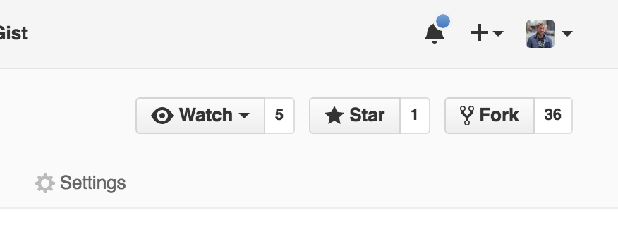
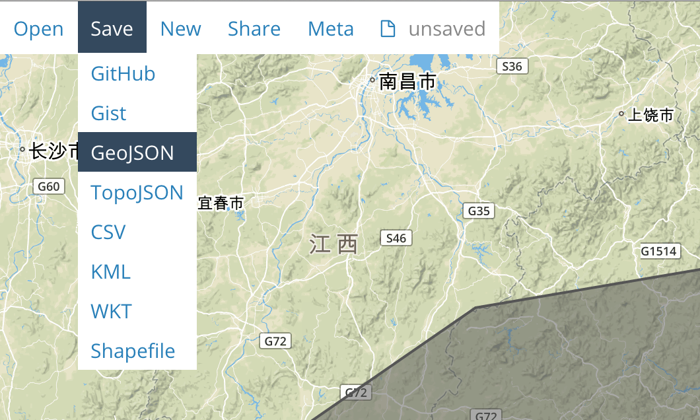

geojson
=======

A repository to create, edit, and break GeoJSON files.

### STEP 1: Fork repository

From your own account, `fork` this repository with the fork button.



### STEP 2: Clone your forked repo

```
git clone https://github.com/USERNAME/geojson.git
```

This will create a new folder called `geojson/`. Don't forget to navigate into that project once you've cloned it with:

```
cd geojson/
```

### STEP 3: Make a GeoJSON

Head to [geojson.io](https://geojson.io) to create a new GeoJSON file. Once you've created the file, you can download it as a GeoJSON file format from the menu:



Add the file to your local version of the project. **Rename the file to be `YOUR-USERNAME.geojson`**.

### STEP 4: Add new file

Add the file to be tracked by Git. From within the repository project directory:

```
git add YOUR-USERNAME.geojson
```

### STEP 5: Commit new file

```
git commit -m 'Adding <filename>'
```

### STEP 6: Push the changes to your forked repository

```
git push origin master
```

### STEP 7: Make a pull request

Head to your forked repository page on GitHub and click the green "create pull request" button to make a pull request. If everything looks good, a MaptimeSEA project maintainer will merge your changes into the main project!
